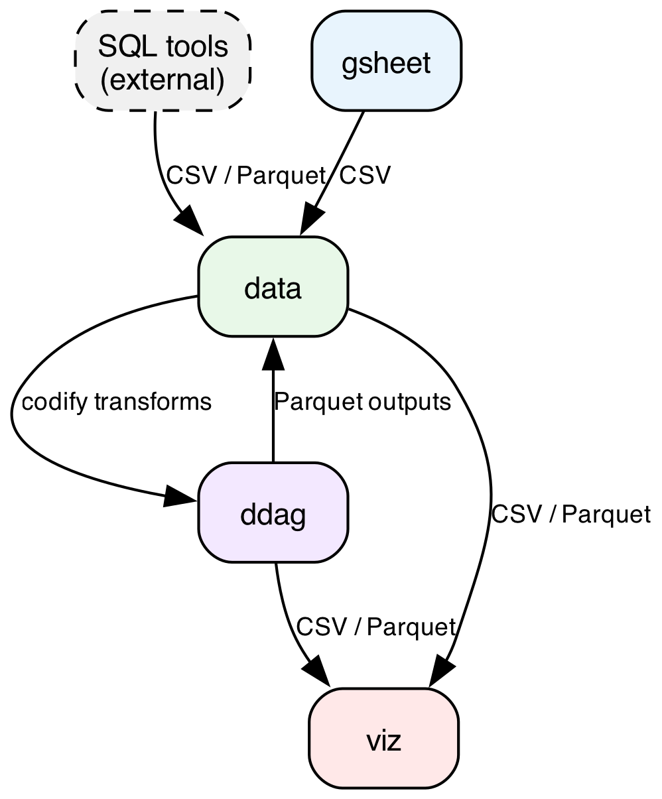

# Claude Tools

A repository for managing and distributing Claude Code extensions: skills, agents, and commands.

## Installing Claude Code

Install Claude Code using the native installer (no Node.js required):

**macOS / Linux:**
```bash
curl -fsSL https://claude.ai/install.sh | bash
```

**Windows (PowerShell):**
```powershell
irm https://claude.ai/install.ps1 | iex
```

Then authenticate by running:
```bash
claude
```

For more details, see the [official setup guide](https://code.claude.com/docs/en/setup).

## Prerequisites

For the best experience, install the recommended Claude Code plugins. See [PLUGIN_SETUP.md](PLUGIN_SETUP.md) for setup instructions.

## Installation

Use the built-in `/install` and `/uninstall` commands to manage tools from this repository:

```
/install        # Interactive installation wizard
/install list   # Show available tools

/uninstall      # Interactive uninstall wizard
/uninstall list # Show installed tools
```

The wizard will prompt you to choose:
- **Target**: Global (`~/.claude/`) or project (`.claude/`)
- **Mode**: Copy files or create symlinks
- **Tools**: Which tools to install

## Creating Tools

Each tool is a top-level directory containing one or more component types:

```
my_tool/
├── skills/                 # Skill definitions
│   ├── SKILL.md           # Required - defines the skill
│   ├── scripts/           # Optional - executable code
│   ├── references/        # Optional - documentation
│   └── assets/            # Optional - templates, images
├── agents/                # Optional - agent definitions
│   └── my-agent.md
└── commands/              # Optional - legacy commands
    └── my-command.md
```

### Skills

Skills are the primary extension mechanism. A skill requires `skills/SKILL.md` with YAML frontmatter:

```yaml
---
name: my-skill
description: What this skill does
allowed-tools: Read, Bash(python {SKILL_DIR}/scripts/*.py)
---

# My Skill

Instructions for Claude when using this skill...
```

### Agents

Agents are markdown files defining specialized personas for the Task tool. Place them in `agents/` as individual `.md` files.

### Commands (Legacy)

Commands are simple markdown files without frontmatter. Skills are recommended for new development.

## Path Placeholders

Use these placeholders in SKILL.md for portable paths:

| Placeholder | Resolves To |
|-------------|-------------|
| `{SKILL_DIR}` | Directory containing SKILL.md |
| `{AGENTS_DIR}` | The agents directory |

## Installation Modes

| Mode | Pros | Cons |
|------|------|------|
| **Copy** | Portable, independent | Won't auto-update |
| **Symlink** | Auto-updates with repo | Requires repo access |

## Data Toolkit

Four tools that work together for end-to-end data workflows. They pick up where your SQL tools leave off.

| Tool | Core Capability |
|------|----------------|
| **gsheet** | Pull Google Sheets data down as local CSV files with interactive tab selection |
| **data** | Wrangle, clean, profile, and analyze tabular data (polars / pandas / duckdb). Open files interactively with VisiData. |
| **ddag** | Define reproducible data pipelines — each node stores transform metadata with Makefile-like staleness tracking |
| **viz** | Render publication-quality matplotlib/seaborn charts from prepared data files |

### How they connect

- **SQL tools → data** — Query results (CSV/Parquet exports) from any database client feed into the data skill for wrangling
- **gsheet → data** — Downloaded CSVs are probed and cleaned by the data skill
- **data → ddag** — Ad-hoc transforms get codified into reproducible pipeline nodes
- **data → viz** — Cleaned data prepared as `.viz/<name>.parquet` for charting
- **ddag → data / viz** — Pipeline outputs feed back into analysis or visualization



## Contributing

1. Create a new top-level directory for your tool
2. Add components following the structure above
3. Run `/install list` to verify discovery
4. Test installation with both copy and symlink modes
